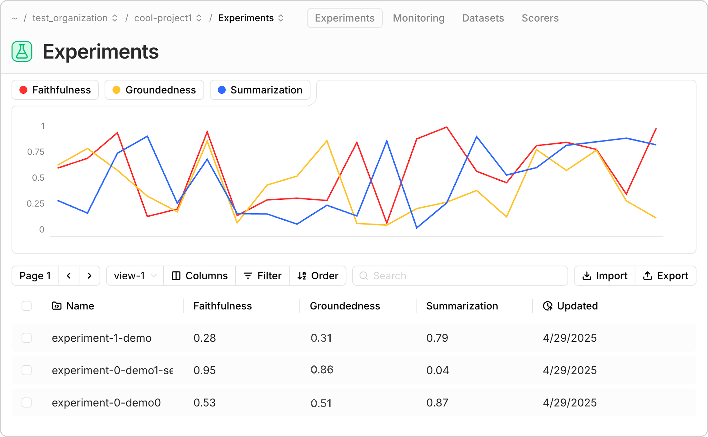
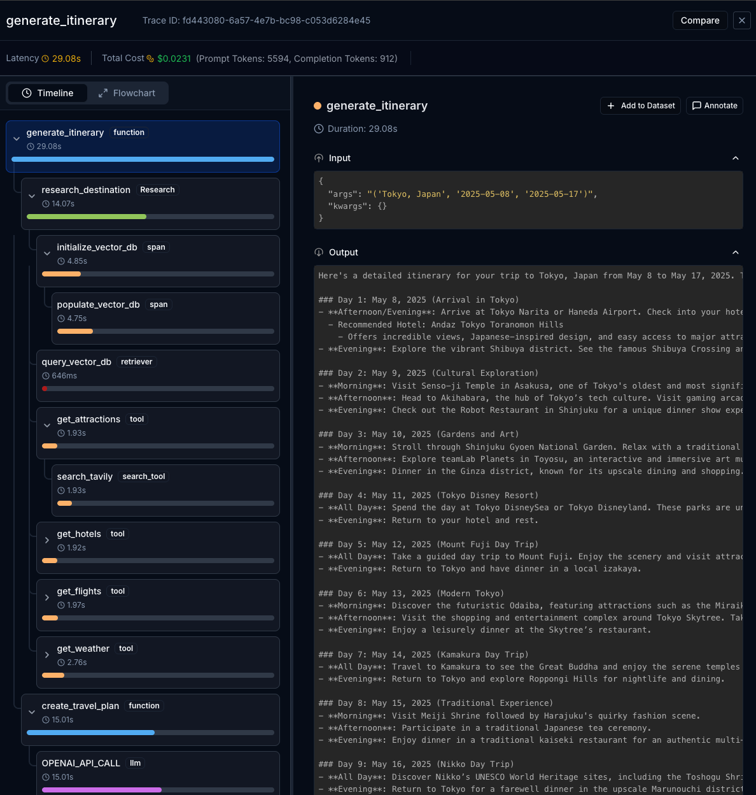
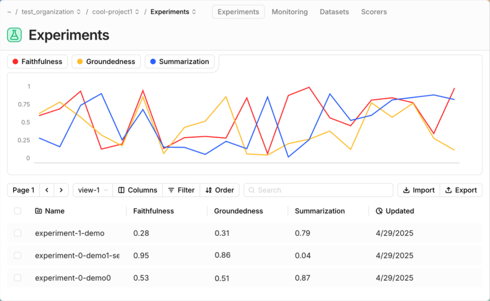
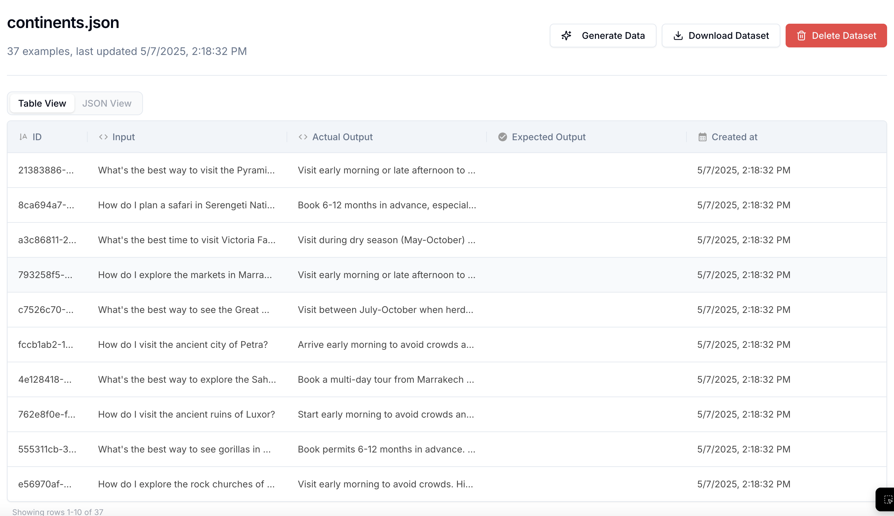
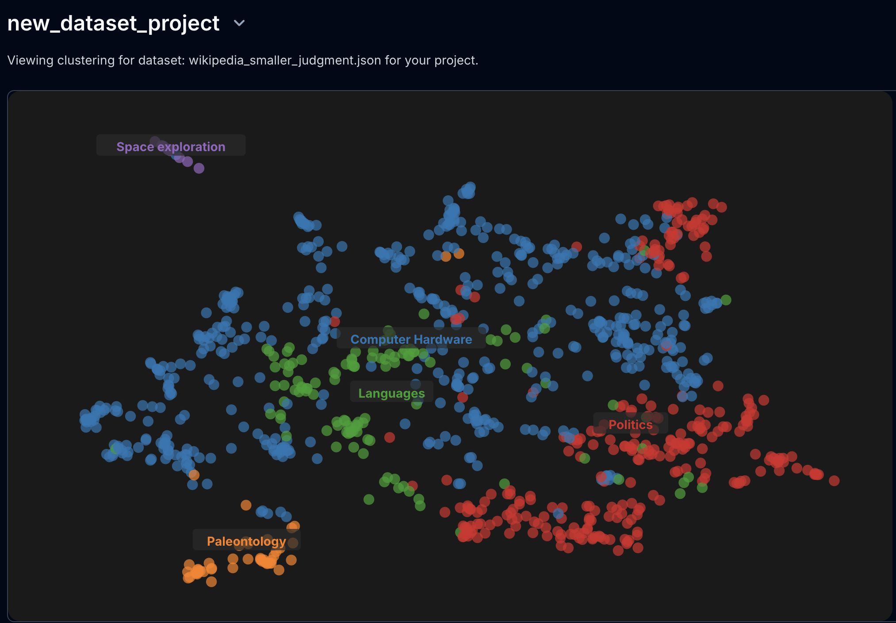

<div align="center">


**Build monitoring & evaluation pipelines for complex agents**



<br>

## [🌐 Landing Page](https://www.judgmentlabs.ai/)  • [📚 Docs](https://judgment.mintlify.app/getting_started) • [🚀 Demos](https://www.youtube.com/@AlexShan-j3o) 

[](https://x.com/JudgmentLabs)
[](https://www.linkedin.com/company/judgmentlabs)
[](https://discord.gg/FMxHkYTtFE)

</div>

## Judgeval: open-source testing, monitoring, and optimization for AI agents

Judgeval offers robust tooling for evaluating and tracing LLM agent systems. It is dev-friendly and open-source (licensed under Apache 2.0). 

Judgeval gets you started in five minutes, after which you'll be ready to use all of its features as your agent becomes more complex. Judgeval is natively connected to the [Judgment Platform](https://www.judgmentlabs.ai/) for free and you can export your data and self-host at any time.

We support tracing agents built with LangGraph, OpenAI SDK, Anthropic, ... and allow custom eval integrations for any use case. Check out our quickstarts below or our [setup guide](https://docs.judgmentlabs.ai/getting-started) to get started.

Judgeval is created and maintained by [Judgment Labs](https://judgmentlabs.ai/).

## 📋 Table of Contents
* [✨ Features](#-features)
    * [🔍 Tracing](#-tracing)
    * [🧪 Evals](#-evals)
    * [📡 Monitoring](#-monitoring)
    * [📊 Datasets](#-datasets)
    * [💡 Insights](#-insights)
* [🛠️ Installation](#️-installation)
* [🏁 Get Started](#-get-started)
* [🏢 Self-Hosting](#-self-hosting)
* [📚 Cookbooks](#-cookbooks)
* [💻 Development with Cursor](#-development-with-cursor)
* [⭐ Star Us on GitHub](#-star-us-on-github)
* [❤️ Contributors](#️-contributors)

<!-- Created by https://github.com/ekalinin/github-markdown-toc -->


## ✨ Features

|  |  |
|:---|:---:|
| <h3>🔍 Tracing</h3>Automatic agent tracing integrated with common frameworks (LangGraph, OpenAI, Anthropic): **tracking inputs/outputs, latency, and cost** at every step.<br><br>Online evals can be applied to traces to measure quality on production data in real-time.<br><br>Export trace data to the Judgment Platform or your own S3 buckets, {Parquet, JSON, YAML} files, or data warehouse.<br><br>**Useful for:**<br>• 🐛 Debugging agent runs <br>• 👤 Tracking user activity <br>• 🔬 Pinpointing performance bottlenecks| <p align="center"></p> |
| <h3>🧪 Evals</h3>15+ research-backed metrics including tool call accuracy, hallucinations, instruction adherence, and retrieval context recall.<br><br>Build custom evaluators that connect with our metric-tracking infrastructure. <br><br>**Useful for:**<br>• ⚠️ Unit-testing <br>• 🔬 Experimental prompt testing<br>• 🛡️ Online guardrails <br><br> | <p align="center"></p> |
| <h3>📡 Monitoring</h3>Real-time performance tracking of your agents in production environments. **Track all your metrics in one place.**<br><br>Set up **Slack/email alerts** for critical metrics and receive notifications when thresholds are exceeded.<br><br> **Useful for:** <br>•📉 Identifying degradation early <br>•📈 Visualizing performance trends across versions and time | <p align="center"></p> |
| <h3>📊 Datasets</h3>Export trace data or import external testcases to datasets hosted on Judgment's Platform. Move datasets to/from Parquet, S3, etc. <br><br>Run evals on datasets as unit tests or to A/B test different agent configurations. <br><br> **Useful for:**<br>• 🔄 Scaled analysis for A/B tests <br>• 🗃️ Filtered collections of agent runtime data| <p align="center"></p> |
| <h3>💡 Insights</h3>Cluster on your data to reveal common use cases and failure modes.<br><br>Trace failures to their exact source with Judgment's Osiris agent, which localizes errors to specific components for precise fixes.<br><br> **Useful for:**<br>•🔮 Surfacing common inputs that lead to error<br>•🤖 Investigating agent/user behavior for optimization <br>| <p align="center"></p> |

## 🛠️ Installation

Get started with Judgeval by installing our SDK using pip:

```bash
pip install judgeval
```

Ensure you have your `JUDGMENT_API_KEY` and `JUDGMENT_ORG_ID` environment variables set to connect to the [Judgment platform](https://app.judgmentlabs.ai/). 

**If you don't have keys, [create an account](https://app.judgmentlabs.ai/register) on the platform!**

## 🏁 Get Started

Here's how you can quickly start using Judgeval:

### 🛰️ Tracing

Track your agent execution with full observability with just a few lines of code.
Create a file named `traces.py` with the following code:

```python
from judgeval.common.tracer import Tracer, wrap
from openai import OpenAI

client = wrap(OpenAI())
judgment = Tracer(project_name="my_project")

@judgment.observe(span_type="tool")
def my_tool():
    return "What's the capital of the U.S.?"

@judgment.observe(span_type="function")
def main():
    task_input = my_tool()
    res = client.chat.completions.create(
        model="gpt-4.1",
        messages=[{"role": "user", "content": f"{task_input}"}]
    )
    return res.choices[0].message.content

main()
```

[Click here](https://docs.judgmentlabs.ai/getting-started#create-your-first-trace) for a more detailed explanation.

### 📝 Offline Evaluations

You can evaluate your agent's execution to measure quality metrics such as hallucination.
Create a file named `evaluate.py` with the following code:

```python evaluate.py
from judgeval import JudgmentClient
from judgeval.data import Example
from judgeval.scorers import FaithfulnessScorer

client = JudgmentClient()

example = Example(
    input="What if these shoes don't fit?",
    actual_output="We offer a 30-day full refund at no extra cost.",
    retrieval_context=["All customers are eligible for a 30 day full refund at no extra cost."],
)

scorer = FaithfulnessScorer(threshold=0.5)
results = client.run_evaluation(
    examples=[example],
    scorers=[scorer],
    model="gpt-4.1",
)
print(results)
```

[Click here](https://docs.judgmentlabs.ai/getting-started#create-your-first-experiment) for a more detailed explanation.

### 📡 Online Evaluations

Attach performance monitoring on traces to measure the quality of your systems in production.

Using the same `traces.py` file we created earlier, modify `main` function:

```python
from judgeval.common.tracer import Tracer, wrap
from judgeval.scorers import AnswerRelevancyScorer
from openai import OpenAI

client = wrap(OpenAI())
judgment = Tracer(project_name="my_project")

@judgment.observe(span_type="tool")
def my_tool():
    return "Hello world!"

@judgment.observe(span_type="function")
def main():
    task_input = my_tool()
    res = client.chat.completions.create(
        model="gpt-4.1",
        messages=[{"role": "user", "content": f"{task_input}"}]
    ).choices[0].message.content

    judgment.async_evaluate(
        scorers=[AnswerRelevancyScorer(threshold=0.5)],
        input=task_input,
        actual_output=res,
        model="gpt-4.1"
    )
    print("Online evaluation submitted.")
    return res

main()
```

[Click here](https://docs.judgmentlabs.ai/getting-started#create-your-first-online-evaluation) for a more detailed explanation.

## 🏢 Self-Hosting

Run Judgment on your own infrastructure: we provide comprehensive self-hosting capabilities that give you full control over the backend and data plane that Judgeval interfaces with.

### Key Features
* Deploy Judgment on your own AWS account
* Store data in your own Supabase instance
* Access Judgment through your own custom domain

### Getting Started
1. Check out our [self-hosting documentation](https://docs.judgmentlabs.ai/self-hosting/get_started) for detailed setup instructions, along with how your self-hosted instance can be accessed
2. Use the [Judgment CLI](https://github.com/JudgmentLabs/judgment-cli) to deploy your self-hosted environment
3. After your self-hosted instance is setup, make sure the `JUDGMENT_API_URL` environmental variable is set to your self-hosted backend endpoint

## 📚 Cookbooks

Have your own? We're happy to feature it if you create a PR or message us on [Discord](https://discord.gg/taAufyhf).

You can access our repo of cookbooks [here](https://github.com/JudgmentLabs/judgment-cookbook). Here are some highlights:

### Sample Agents

#### 💰 [LangGraph Financial QA Agent](https://github.com/JudgmentLabs/judgment-cookbook/blob/main/cookbooks/financial_agent/demo.py)
A LangGraph-based agent for financial queries, featuring RAG capabilities with a vector database for contextual data retrieval and evaluation of its reasoning and data accuracy.

#### ✈️ [OpenAI Travel Agent](https://github.com/JudgmentLabs/judgment-cookbook/blob/main/cookbooks/openai_travel_agent/agent.py)
A travel planning agent using OpenAI API calls, custom tool functions, and RAG with a vector database for up-to-date and contextual travel information. Evaluated for itinerary quality and information relevance.

### Custom Evaluators

#### 🔍 [PII Detection](https://github.com/JudgmentLabs/judgment-cookbook/blob/main/cookbooks/classifier_scorer/pii_checker.py)
Detecting and evaluating Personal Identifiable Information (PII) leakage.

#### 📧 [Cold Email Generation](https://github.com/JudgmentLabs/judgment-cookbook/blob/main/cookbooks/custom_scorers/cold_email_scorer.py)

Evaluates if a cold email generator properly utilizes all relevant information about the target recipient.

## 💻 Development with Cursor
When building agents and LLM workflows in Cursor, providing proper context to your coding assistant helps ensure seamless integration with Judgment. This rule file supplies the essential context your coding assistant needs for successful implementation.

To implement this rule file, simply copy the text below and save it in a ".cursor/rules" directory in your project's root directory.

<details>

<summary>Cursor Rule File</summary>

````
---
You are an expert in helping users integrate Judgment with their codebase. When you are helping someone integrate Judgment tracing or evaluations with their agents/workflows, refer to this file. 
---

# Common Questions You May Get from the User (and How to Handle These Cases):

## Sample Agent 1:
```
from uuid import uuid4
import openai
import os
import asyncio
from tavily import TavilyClient
from dotenv import load_dotenv
import chromadb
from chromadb.utils import embedding_functions

destinations_data = [
    {
        "destination": "Paris, France",
        "information": """
Paris is the capital city of France and a global center for art, fashion, and culture.
Key Information:
- Best visited during spring (March-May) or fall (September-November)
- Famous landmarks: Eiffel Tower, Louvre Museum, Notre-Dame Cathedral, Arc de Triomphe
- Known for: French cuisine, café culture, fashion, art galleries
- Local transportation: Metro system is extensive and efficient
- Popular neighborhoods: Le Marais, Montmartre, Latin Quarter
- Cultural tips: Basic French phrases are appreciated; many restaurants close between lunch and dinner
- Must-try experiences: Seine River cruise, visiting local bakeries, Luxembourg Gardens
"""
    },
    {
        "destination": "Tokyo, Japan",
        "information": """
Tokyo is Japan's bustling capital, blending ultramodern and traditional elements.
Key Information:
- Best visited during spring (cherry blossoms) or fall (autumn colors)
- Famous areas: Shibuya, Shinjuku, Harajuku, Akihabara
- Known for: Technology, anime culture, sushi, efficient public transport
- Local transportation: Extensive train and subway network
- Cultural tips: Bow when greeting, remove shoes indoors, no tipping
- Must-try experiences: Robot Restaurant, teamLab Borderless, Tsukiji Outer Market
- Popular day trips: Mount Fuji, Kamakura, Nikko
"""
    },
    {
        "destination": "New York City, USA",
        "information": """
New York City is a global metropolis known for its diversity, culture, and iconic skyline.
Key Information:
- Best visited during spring (April-June) or fall (September-November)
- Famous landmarks: Statue of Liberty, Times Square, Central Park, Empire State Building
- Known for: Broadway shows, diverse cuisine, shopping, museums
- Local transportation: Extensive subway system, yellow cabs, ride-sharing
- Popular areas: Manhattan, Brooklyn, Queens
- Cultural tips: Fast-paced environment, tipping expected (15-20%)
- Must-try experiences: Broadway show, High Line walk, food tours
"""
    },
    {
        "destination": "Barcelona, Spain",
        "information": """
Barcelona is a vibrant city known for its art, architecture, and Mediterranean culture.
Key Information:
- Best visited during spring and fall for mild weather
- Famous landmarks: Sagrada Familia, Park Güell, Casa Batlló
- Known for: Gaudi architecture, tapas, beach culture, FC Barcelona
- Local transportation: Metro, buses, and walkable city center
- Popular areas: Gothic Quarter, Eixample, La Barceloneta
- Cultural tips: Late dinner times (after 8 PM), siesta tradition
- Must-try experiences: La Rambla walk, tapas crawl, local markets
"""
    },
    {
        "destination": "Bangkok, Thailand",
        "information": """
Bangkok is Thailand's capital city, famous for its temples, street food, and vibrant culture.
Key Information:
- Best visited during November to February (cool and dry season)
- Famous sites: Grand Palace, Wat Phra Kaew, Wat Arun
- Known for: Street food, temples, markets, nightlife
- Local transportation: BTS Skytrain, MRT, tuk-tuks, river boats
- Popular areas: Sukhumvit, Old City, Chinatown
- Cultural tips: Dress modestly at temples, respect royal family
- Must-try experiences: Street food tours, river cruises, floating markets
"""
    }
]

client = openai.Client(api_key=os.getenv("OPENAI_API_KEY"))

def populate_vector_db(collection, destinations_data):
    """
    Populate the vector DB with travel information.
    destinations_data should be a list of dictionaries with 'destination' and 'information' keys
    """
    for data in destinations_data:
        collection.add(
            documents=[data['information']],
            metadatas=[{"destination": data['destination']}],
            ids=[f"destination_{data['destination'].lower().replace(' ', '_')}"]
        )

def search_tavily(query):
    """Fetch travel data using Tavily API."""
    API_KEY = os.getenv("TAVILY_API_KEY")
    client = TavilyClient(api_key=API_KEY)
    results = client.search(query, num_results=3)
    return results

async def get_attractions(destination):
    """Search for top attractions in the destination."""
    prompt = f"Best tourist attractions in {destination}"
    attractions_search = search_tavily(prompt)
    return attractions_search

async def get_hotels(destination):
    """Search for hotels in the destination."""
    prompt = f"Best hotels in {destination}"
    hotels_search = search_tavily(prompt)
    return hotels_search

async def get_flights(destination):
    """Search for flights to the destination."""
    prompt = f"Flights to {destination} from major cities"
    flights_search = search_tavily(prompt)
    return flights_search

async def get_weather(destination, start_date, end_date):
    """Search for weather information."""
    prompt = f"Weather forecast for {destination} from {start_date} to {end_date}"
    weather_search = search_tavily(prompt)
    return weather_search

def initialize_vector_db():
    """Initialize ChromaDB with OpenAI embeddings."""
    client = chromadb.Client()
    embedding_fn = embedding_functions.OpenAIEmbeddingFunction(
        api_key=os.getenv("OPENAI_API_KEY"),
        model_name="text-embedding-3-small"
    )
    res = client.get_or_create_collection(
        "travel_information",
        embedding_function=embedding_fn
    )
    populate_vector_db(res, destinations_data)
    return res

def query_vector_db(collection, destination, k=3):
    """Query the vector database for existing travel information."""
    try:
        results = collection.query(
            query_texts=[destination],
            n_results=k
        )
        return results['documents'][0] if results['documents'] else []
    except Exception:
        return []

async def research_destination(destination, start_date, end_date):
    """Gather all necessary travel information for a destination."""
    # First, check the vector database
    collection = initialize_vector_db()
    existing_info = query_vector_db(collection, destination)
    
    # Get real-time information from Tavily
    tavily_data = {
        "attractions": await get_attractions(destination),
        "hotels": await get_hotels(destination),
        "flights": await get_flights(destination),
        "weather": await get_weather(destination, start_date, end_date)
    }
    
    return {
        "vector_db_results": existing_info,
        **tavily_data
    }

async def create_travel_plan(destination, start_date, end_date, research_data):
    """Generate a travel itinerary using the researched data."""
    vector_db_context = "\n".join(research_data['vector_db_results']) if research_data['vector_db_results'] else "No pre-stored information available."
    
    prompt = f"""
    Create a structured travel itinerary for a trip to {destination} from {start_date} to {end_date}.
    
    Pre-stored destination information:
    {vector_db_context}
    
    Current travel data:
    - Attractions: {research_data['attractions']}
    - Hotels: {research_data['hotels']}
    - Flights: {research_data['flights']}
    - Weather: {research_data['weather']}
    """
    
    response = client.chat.completions.create(
        model="gpt-4.1",
        messages=[
            {"role": "system", "content": "You are an expert travel planner. Combine both historical and current information to create the best possible itinerary."},
            {"role": "user", "content": prompt}
        ]
    ).choices[0].message.content
    
    return response

async def generate_itinerary(destination, start_date, end_date):
    """Main function to generate a travel itinerary."""
    research_data = await research_destination(destination, start_date, end_date)
    res = await create_travel_plan(destination, start_date, end_date, research_data)
    return res


if __name__ == "__main__":
    load_dotenv()
    destination = input("Enter your travel destination: ")
    start_date = input("Enter start date (YYYY-MM-DD): ")
    end_date = input("Enter end date (YYYY-MM-DD): ")
    itinerary = asyncio.run(generate_itinerary(destination, start_date, end_date))
    print("\nGenerated Itinerary:\n", itinerary)
```

## Sample Query 1:
Can you add Judgment tracing to my file?

## Example of Modified Code after Query 1:
```
from uuid import uuid4
import openai
import os
import asyncio
from tavily import TavilyClient
from dotenv import load_dotenv
import chromadb
from chromadb.utils import embedding_functions

from judgeval.tracer import Tracer, wrap
from judgeval.scorers import AnswerRelevancyScorer, FaithfulnessScorer
from judgeval.data import Example

destinations_data = [
    {
        "destination": "Paris, France",
        "information": """
Paris is the capital city of France and a global center for art, fashion, and culture.
Key Information:
- Best visited during spring (March-May) or fall (September-November)
- Famous landmarks: Eiffel Tower, Louvre Museum, Notre-Dame Cathedral, Arc de Triomphe
- Known for: French cuisine, café culture, fashion, art galleries
- Local transportation: Metro system is extensive and efficient
- Popular neighborhoods: Le Marais, Montmartre, Latin Quarter
- Cultural tips: Basic French phrases are appreciated; many restaurants close between lunch and dinner
- Must-try experiences: Seine River cruise, visiting local bakeries, Luxembourg Gardens
"""
    },
    {
        "destination": "Tokyo, Japan",
        "information": """
Tokyo is Japan's bustling capital, blending ultramodern and traditional elements.
Key Information:
- Best visited during spring (cherry blossoms) or fall (autumn colors)
- Famous areas: Shibuya, Shinjuku, Harajuku, Akihabara
- Known for: Technology, anime culture, sushi, efficient public transport
- Local transportation: Extensive train and subway network
- Cultural tips: Bow when greeting, remove shoes indoors, no tipping
- Must-try experiences: Robot Restaurant, teamLab Borderless, Tsukiji Outer Market
- Popular day trips: Mount Fuji, Kamakura, Nikko
"""
    },
    {
        "destination": "New York City, USA",
        "information": """
New York City is a global metropolis known for its diversity, culture, and iconic skyline.
Key Information:
- Best visited during spring (April-June) or fall (September-November)
- Famous landmarks: Statue of Liberty, Times Square, Central Park, Empire State Building
- Known for: Broadway shows, diverse cuisine, shopping, museums
- Local transportation: Extensive subway system, yellow cabs, ride-sharing
- Popular areas: Manhattan, Brooklyn, Queens
- Cultural tips: Fast-paced environment, tipping expected (15-20%)
- Must-try experiences: Broadway show, High Line walk, food tours
"""
    },
    {
        "destination": "Barcelona, Spain",
        "information": """
Barcelona is a vibrant city known for its art, architecture, and Mediterranean culture.
Key Information:
- Best visited during spring and fall for mild weather
- Famous landmarks: Sagrada Familia, Park Güell, Casa Batlló
- Known for: Gaudi architecture, tapas, beach culture, FC Barcelona
- Local transportation: Metro, buses, and walkable city center
- Popular areas: Gothic Quarter, Eixample, La Barceloneta
- Cultural tips: Late dinner times (after 8 PM), siesta tradition
- Must-try experiences: La Rambla walk, tapas crawl, local markets
"""
    },
    {
        "destination": "Bangkok, Thailand",
        "information": """
Bangkok is Thailand's capital city, famous for its temples, street food, and vibrant culture.
Key Information:
- Best visited during November to February (cool and dry season)
- Famous sites: Grand Palace, Wat Phra Kaew, Wat Arun
- Known for: Street food, temples, markets, nightlife
- Local transportation: BTS Skytrain, MRT, tuk-tuks, river boats
- Popular areas: Sukhumvit, Old City, Chinatown
- Cultural tips: Dress modestly at temples, respect royal family
- Must-try experiences: Street food tours, river cruises, floating markets
"""
    }
]

client = wrap(openai.Client(api_key=os.getenv("OPENAI_API_KEY")))
judgment = Tracer(api_key=os.getenv("JUDGMENT_API_KEY"), project_name="travel_agent_demo")

def populate_vector_db(collection, destinations_data):
    """
    Populate the vector DB with travel information.
    destinations_data should be a list of dictionaries with 'destination' and 'information' keys
    """
    for data in destinations_data:
        collection.add(
            documents=[data['information']],
            metadatas=[{"destination": data['destination']}],
            ids=[f"destination_{data['destination'].lower().replace(' ', '_')}"]
        )

@judgment.observe(span_type="search_tool")
def search_tavily(query):
    """Fetch travel data using Tavily API."""
    API_KEY = os.getenv("TAVILY_API_KEY")
    client = TavilyClient(api_key=API_KEY)
    results = client.search(query, num_results=3)
    return results

@judgment.observe(span_type="tool")
async def get_attractions(destination):
    """Search for top attractions in the destination."""
    prompt = f"Best tourist attractions in {destination}"
    attractions_search = search_tavily(prompt)
    return attractions_search

@judgment.observe(span_type="tool")
async def get_hotels(destination):
    """Search for hotels in the destination."""
    prompt = f"Best hotels in {destination}"
    hotels_search = search_tavily(prompt)
    return hotels_search

@judgment.observe(span_type="tool")
async def get_flights(destination):
    """Search for flights to the destination."""
    prompt = f"Flights to {destination} from major cities"
    flights_search = search_tavily(prompt)
    example = Example(
        input=prompt,
        actual_output=str(flights_search["results"])
    )
    judgment.async_evaluate(
        scorers=[AnswerRelevancyScorer(threshold=0.5)],
        example=example,
        model="gpt-4.1"
    )
    return flights_search

@judgment.observe(span_type="tool")
async def get_weather(destination, start_date, end_date):
    """Search for weather information."""
    prompt = f"Weather forecast for {destination} from {start_date} to {end_date}"
    weather_search = search_tavily(prompt)
    example = Example(
        input=prompt,
        actual_output=str(weather_search["results"])
    )
    judgment.async_evaluate(
        scorers=[AnswerRelevancyScorer(threshold=0.5)],
        example=example,
        model="gpt-4.1"
    )
    return weather_search

def initialize_vector_db():
    """Initialize ChromaDB with OpenAI embeddings."""
    client = chromadb.Client()
    embedding_fn = embedding_functions.OpenAIEmbeddingFunction(
        api_key=os.getenv("OPENAI_API_KEY"),
        model_name="text-embedding-3-small"
    )
    res = client.get_or_create_collection(
        "travel_information",
        embedding_function=embedding_fn
    )
    populate_vector_db(res, destinations_data)
    return res

@judgment.observe(span_type="retriever")
def query_vector_db(collection, destination, k=3):
    """Query the vector database for existing travel information."""
    try:
        results = collection.query(
            query_texts=[destination],
            n_results=k
        )
        return results['documents'][0] if results['documents'] else []
    except Exception:
        return []

@judgment.observe(span_type="Research")
async def research_destination(destination, start_date, end_date):
    """Gather all necessary travel information for a destination."""
    # First, check the vector database
    collection = initialize_vector_db()
    existing_info = query_vector_db(collection, destination)
    
    # Get real-time information from Tavily
    tavily_data = {
        "attractions": await get_attractions(destination),
        "hotels": await get_hotels(destination),
        "flights": await get_flights(destination),
        "weather": await get_weather(destination, start_date, end_date)
    }
    
    return {
        "vector_db_results": existing_info,
        **tavily_data
    }

@judgment.observe(span_type="function")
async def create_travel_plan(destination, start_date, end_date, research_data):
    """Generate a travel itinerary using the researched data."""
    vector_db_context = "\n".join(research_data['vector_db_results']) if research_data['vector_db_results'] else "No pre-stored information available."
    
    prompt = f"""
    Create a structured travel itinerary for a trip to {destination} from {start_date} to {end_date}.
    
    Pre-stored destination information:
    {vector_db_context}
    
    Current travel data:
    - Attractions: {research_data['attractions']}
    - Hotels: {research_data['hotels']}
    - Flights: {research_data['flights']}
    - Weather: {research_data['weather']}
    """
    
    response = client.chat.completions.create(
        model="gpt-4.1",
        messages=[
            {"role": "system", "content": "You are an expert travel planner. Combine both historical and current information to create the best possible itinerary."},
            {"role": "user", "content": prompt}
        ]
    ).choices[0].message.content

    example = Example(
        input=prompt,
        actual_output=str(response),
        retrieval_context=[str(vector_db_context), str(research_data)]
    )
    judgment.async_evaluate(
        scorers=[FaithfulnessScorer(threshold=0.5)],
        example=example,
        model="gpt-4.1"
    )
    
    return response

@judgment.observe(span_type="function")
async def generate_itinerary(destination, start_date, end_date):
    """Main function to generate a travel itinerary."""
    research_data = await research_destination(destination, start_date, end_date)
    res = await create_travel_plan(destination, start_date, end_date, research_data)
    return res


if __name__ == "__main__":
    load_dotenv()
    destination = input("Enter your travel destination: ")
    start_date = input("Enter start date (YYYY-MM-DD): ")
    end_date = input("Enter end date (YYYY-MM-DD): ")
    itinerary = asyncio.run(generate_itinerary(destination, start_date, end_date))
    print("\nGenerated Itinerary:\n", itinerary)
```

## Sample Agent 2
```
from langchain_openai import ChatOpenAI
import asyncio
import os

import chromadb
from chromadb.utils import embedding_functions

from vectordbdocs import financial_data

from typing import Optional
from langchain_core.messages import BaseMessage, HumanMessage, SystemMessage, ChatMessage
from typing_extensions import TypedDict
from langgraph.graph import StateGraph

# Define our state type
class AgentState(TypedDict):
    messages: list[BaseMessage]
    category: Optional[str]
    documents: Optional[str]
    
def populate_vector_db(collection, raw_data):
    """
    Populate the vector DB with financial information.
    """
    for data in raw_data:
        collection.add(
            documents=[data['information']],
            metadatas=[{"category": data['category']}],
            ids=[f"category_{data['category'].lower().replace(' ', '_')}_{os.urandom(4).hex()}"]
        )

# Define a ChromaDB collection for document storage
client = chromadb.Client()
collection = client.get_or_create_collection(
    name="financial_docs",
    embedding_function=embedding_functions.OpenAIEmbeddingFunction(api_key=os.getenv("OPENAI_API_KEY"))
)

populate_vector_db(collection, financial_data)

def pnl_retriever(state: AgentState) -> AgentState:
    query = state["messages"][-1].content
    results = collection.query(
        query_texts=[query],
        where={"category": "pnl"},
        n_results=3
    )
    documents = []
    for document in results["documents"]:
        documents += document

    return {"messages": state["messages"], "documents": documents}

def balance_sheet_retriever(state: AgentState) -> AgentState:
    query = state["messages"][-1].content
    results = collection.query(
        query_texts=[query],
        where={"category": "balance_sheets"},
        n_results=3
    )
    documents = []
    for document in results["documents"]:
        documents += document

    return {"messages": state["messages"], "documents": documents}

def stock_retriever(state: AgentState) -> AgentState:
    query = state["messages"][-1].content
    results = collection.query(
        query_texts=[query],
        where={"category": "stocks"},
        n_results=3
    )
    documents = []
    for document in results["documents"]:
        documents += document

    return {"messages": state["messages"], "documents": documents}

async def bad_classifier(state: AgentState) -> AgentState:
    return {"messages": state["messages"], "category": "stocks"}

async def bad_classify(state: AgentState) -> AgentState:
    category = await bad_classifier(state)

    return {"messages": state["messages"], "category": category["category"]}

async def bad_sql_generator(state: AgentState) -> AgentState:
    ACTUAL_OUTPUT = "SELECT * FROM pnl WHERE stock_symbol = 'GOOGL'"
    return {"messages": state["messages"] + [ChatMessage(content=ACTUAL_OUTPUT, role="text2sql")]}

# Create the classifier node with a system prompt
async def classify(state: AgentState) -> AgentState:
    messages = state["messages"]
    input_msg = [
        SystemMessage(content="""You are a financial query classifier. Your job is to classify user queries into one of three categories:
        - 'pnl' for Profit and Loss related queries
        - 'balance_sheets' for Balance Sheet related queries
        - 'stocks' for Stock market related queries
        
        Respond ONLY with the category name in lowercase, nothing else."""),
        *messages
    ]
    
    response = ChatOpenAI(model="gpt-4.1", temperature=0).invoke(
        input=input_msg
    )

    return {"messages": state["messages"], "category": response.content}

# Add router node to direct flow based on classification
def router(state: AgentState) -> str:
    return state["category"]

async def generate_response(state: AgentState) -> AgentState:
    messages = state["messages"]
    documents = state.get("documents", "")

    OUTPUT = """
        SELECT 
            stock_symbol,
            SUM(CASE WHEN transaction_type = 'buy' THEN quantity ELSE -quantity END) AS total_shares,
            SUM(CASE WHEN transaction_type = 'buy' THEN quantity * price_per_share ELSE -quantity * price_per_share END) AS total_cost,
            MAX(CASE WHEN transaction_type = 'buy' THEN price_per_share END) AS current_market_price
        FROM 
            stock_transactions
        WHERE 
            stock_symbol = 'META'
        GROUP BY 
            stock_symbol;
        """

    return {"messages": messages + [ChatMessage(content=OUTPUT, role="text2sql")], "documents": documents}

async def main():
        # Initialize the graph
        graph_builder = StateGraph(AgentState)

        # Add classifier node
        # For failure test, pass in bad_classifier
        graph_builder.add_node("classifier", classify)
        # graph_builder.add_node("classifier", bad_classify)
        
        # Add conditional edges based on classification
        graph_builder.add_conditional_edges(
            "classifier",
            router,
            {
                "pnl": "pnl_retriever",
                "balance_sheets": "balance_sheet_retriever",
                "stocks": "stock_retriever"
            }
        )
        
        # Add retriever nodes (placeholder functions for now)
        graph_builder.add_node("pnl_retriever", pnl_retriever)
        graph_builder.add_node("balance_sheet_retriever", balance_sheet_retriever)
        graph_builder.add_node("stock_retriever", stock_retriever)

        # Add edges from retrievers to response generator
        graph_builder.add_node("response_generator", generate_response)
        # graph_builder.add_node("response_generator", bad_sql_generator)
        graph_builder.add_edge("pnl_retriever", "response_generator")
        graph_builder.add_edge("balance_sheet_retriever", "response_generator")
        graph_builder.add_edge("stock_retriever", "response_generator")
        
        graph_builder.set_entry_point("classifier")
        graph_builder.set_finish_point("response_generator")

        # Compile the graph
        graph = graph_builder.compile()
        
        response = await graph.ainvoke({
            "messages": [HumanMessage(content="Please calculate our PNL on Apple stock. Refer to table information from documents provided.")],
            "category": None,
        })
    
        print(f"Response: {response['messages'][-1].content}")

if __name__ == "__main__":
    asyncio.run(main())
```

## Sample Query 2:
Can you add Judgment tracing to my file?

## Example of Modified Code after Query 2:
```
from langchain_openai import ChatOpenAI
import asyncio
import os

import chromadb
from chromadb.utils import embedding_functions

from vectordbdocs import financial_data

from typing import Optional
from langchain_core.messages import BaseMessage, HumanMessage, SystemMessage, ChatMessage
from typing_extensions import TypedDict
from langgraph.graph import StateGraph

from judgeval.common.tracer import Tracer
from judgeval.integrations.langgraph import JudgevalCallbackHandler
from judgeval.scorers import AnswerCorrectnessScorer, FaithfulnessScorer
from judgeval.data import Example


judgment = Tracer(project_name="FINANCIAL_AGENT")

# Define our state type
class AgentState(TypedDict):
    messages: list[BaseMessage]
    category: Optional[str]
    documents: Optional[str]
    
def populate_vector_db(collection, raw_data):
    """
    Populate the vector DB with financial information.
    """
    for data in raw_data:
        collection.add(
            documents=[data['information']],
            metadatas=[{"category": data['category']}],
            ids=[f"category_{data['category'].lower().replace(' ', '_')}_{os.urandom(4).hex()}"]
        )

# Define a ChromaDB collection for document storage
client = chromadb.Client()
collection = client.get_or_create_collection(
    name="financial_docs",
    embedding_function=embedding_functions.OpenAIEmbeddingFunction(api_key=os.getenv("OPENAI_API_KEY"))
)

populate_vector_db(collection, financial_data)

@judgment.observe(name="pnl_retriever", span_type="retriever")
def pnl_retriever(state: AgentState) -> AgentState:
    query = state["messages"][-1].content
    results = collection.query(
        query_texts=[query],
        where={"category": "pnl"},
        n_results=3
    )
    documents = []
    for document in results["documents"]:
        documents += document

    return {"messages": state["messages"], "documents": documents}

@judgment.observe(name="balance_sheet_retriever", span_type="retriever")
def balance_sheet_retriever(state: AgentState) -> AgentState:
    query = state["messages"][-1].content
    results = collection.query(
        query_texts=[query],
        where={"category": "balance_sheets"},
        n_results=3
    )
    documents = []
    for document in results["documents"]:
        documents += document

    return {"messages": state["messages"], "documents": documents}

@judgment.observe(name="stock_retriever", span_type="retriever")
def stock_retriever(state: AgentState) -> AgentState:
    query = state["messages"][-1].content
    results = collection.query(
        query_texts=[query],
        where={"category": "stocks"},
        n_results=3
    )
    documents = []
    for document in results["documents"]:
        documents += document

    return {"messages": state["messages"], "documents": documents}

@judgment.observe(name="bad_classifier", span_type="llm")
async def bad_classifier(state: AgentState) -> AgentState:
    return {"messages": state["messages"], "category": "stocks"}

@judgment.observe(name="bad_classify")
async def bad_classify(state: AgentState) -> AgentState:
    category = await bad_classifier(state)
    
    example = Example(
        input=state["messages"][-1].content,
        actual_output=category["category"],
        expected_output="pnl"
    )
    judgment.async_evaluate(
        scorers=[AnswerCorrectnessScorer(threshold=1)],
        example=example,
        model="gpt-4.1"
    )
    
    return {"messages": state["messages"], "category": category["category"]}

@judgment.observe(name="bad_sql_generator", span_type="llm")
async def bad_sql_generator(state: AgentState) -> AgentState:
    ACTUAL_OUTPUT = "SELECT * FROM pnl WHERE stock_symbol = 'GOOGL'"
    
    example = Example(
        input=state["messages"][-1].content,
        actual_output=ACTUAL_OUTPUT,
        retrieval_context=state.get("documents", []),
        expected_output="""
        SELECT 
            SUM(CASE 
                WHEN transaction_type = 'sell' THEN (price_per_share - (SELECT price_per_share FROM stock_transactions WHERE stock_symbol = 'GOOGL' AND transaction_type = 'buy' LIMIT 1)) * quantity 
                ELSE 0 
            END) AS realized_pnl
        FROM 
            stock_transactions
        WHERE 
            stock_symbol = 'META';
        """
    )
    judgment.async_evaluate(
        scorers=[AnswerCorrectnessScorer(threshold=1), FaithfulnessScorer(threshold=1)],
        example=example,
        model="gpt-4.1"
    )
    return {"messages": state["messages"] + [ChatMessage(content=ACTUAL_OUTPUT, role="text2sql")]}

# Create the classifier node with a system prompt
@judgment.observe(name="classify")
async def classify(state: AgentState) -> AgentState:
    messages = state["messages"]
    input_msg = [
        SystemMessage(content="""You are a financial query classifier. Your job is to classify user queries into one of three categories:
        - 'pnl' for Profit and Loss related queries
        - 'balance_sheets' for Balance Sheet related queries
        - 'stocks' for Stock market related queries
        
        Respond ONLY with the category name in lowercase, nothing else."""),
        *messages
    ]
    
    response = ChatOpenAI(model="gpt-4.1", temperature=0).invoke(
        input=input_msg
    )
    
    example = Example(
        input=str(input_msg),
        actual_output=response.content,
        expected_output="pnl"
    )
    judgment.async_evaluate(
        scorers=[AnswerCorrectnessScorer(threshold=1)],
        example=example,
        model="gpt-4.1"
    )

    return {"messages": state["messages"], "category": response.content}

# Add router node to direct flow based on classification
def router(state: AgentState) -> str:
    return state["category"]

@judgment.observe(name="generate_response")
async def generate_response(state: AgentState) -> AgentState:
    messages = state["messages"]
    documents = state.get("documents", "")

    OUTPUT = """
        SELECT 
            stock_symbol,
            SUM(CASE WHEN transaction_type = 'buy' THEN quantity ELSE -quantity END) AS total_shares,
            SUM(CASE WHEN transaction_type = 'buy' THEN quantity * price_per_share ELSE -quantity * price_per_share END) AS total_cost,
            MAX(CASE WHEN transaction_type = 'buy' THEN price_per_share END) AS current_market_price
        FROM 
            stock_transactions
        WHERE 
            stock_symbol = 'META'
        GROUP BY 
            stock_symbol;
        """
    
    example = Example(
        input=messages[-1].content,
        actual_output=OUTPUT,
        retrieval_context=documents,
        expected_output="""
        SELECT 
            stock_symbol,
            SUM(CASE WHEN transaction_type = 'buy' THEN quantity ELSE -quantity END) AS total_shares,
            SUM(CASE WHEN transaction_type = 'buy' THEN quantity * price_per_share ELSE -quantity * price_per_share END) AS total_cost,
            MAX(CASE WHEN transaction_type = 'buy' THEN price_per_share END) AS current_market_price
        FROM 
            stock_transactions
        WHERE 
            stock_symbol = 'META'
        GROUP BY 
            stock_symbol;
        """
    )
    judgment.async_evaluate(
        scorers=[AnswerCorrectnessScorer(threshold=1), FaithfulnessScorer(threshold=1)],
        example=example,
        model="gpt-4.1"
    )

    return {"messages": messages + [ChatMessage(content=OUTPUT, role="text2sql")], "documents": documents}

async def main():
    with judgment.trace(
        "run_1",
        project_name="FINANCIAL_AGENT",
        overwrite=True
    ) as trace:

        # Initialize the graph
        graph_builder = StateGraph(AgentState)

        # Add classifier node
        # For failure test, pass in bad_classifier
        graph_builder.add_node("classifier", classify)
        # graph_builder.add_node("classifier", bad_classify)
        
        # Add conditional edges based on classification
        graph_builder.add_conditional_edges(
            "classifier",
            router,
            {
                "pnl": "pnl_retriever",
                "balance_sheets": "balance_sheet_retriever",
                "stocks": "stock_retriever"
            }
        )
        
        # Add retriever nodes (placeholder functions for now)
        graph_builder.add_node("pnl_retriever", pnl_retriever)
        graph_builder.add_node("balance_sheet_retriever", balance_sheet_retriever)
        graph_builder.add_node("stock_retriever", stock_retriever)

        # Add edges from retrievers to response generator
        graph_builder.add_node("response_generator", generate_response)
        # graph_builder.add_node("response_generator", bad_sql_generator)
        graph_builder.add_edge("pnl_retriever", "response_generator")
        graph_builder.add_edge("balance_sheet_retriever", "response_generator")
        graph_builder.add_edge("stock_retriever", "response_generator")
        
        graph_builder.set_entry_point("classifier")
        graph_builder.set_finish_point("response_generator")

        # Compile the graph
        graph = graph_builder.compile()
        
        handler = JudgevalCallbackHandler(trace)

        response = await graph.ainvoke({
            "messages": [HumanMessage(content="Please calculate our PNL on Apple stock. Refer to table information from documents provided.")],
            "category": None,
        }, config=dict(callbacks=[handler]))
        trace.save()
    
        print(f"Response: {response['messages'][-1].content}")

if __name__ == "__main__":
    asyncio.run(main())
```


# Official Judgment Documenation


<div align="center">


**Build monitoring & evaluation pipelines for complex agents**


<br>

## @🌐 Landing Page • @Twitter/X • @💼 LinkedIn • @📚 Docs • @🚀 Demos • @🎮 Discord
</div>

## Judgeval: open-source testing, monitoring, and optimization for AI agents

Judgeval offers robust tooling for evaluating and tracing LLM agent systems. It is dev-friendly and open-source (licensed under Apache 2.0). 

Judgeval gets you started in five minutes, after which you'll be ready to use all of its features as your agent becomes more complex. Judgeval is natively connected to the @Judgment Platform for free and you can export your data and self-host at any time.

We support tracing agents built with LangGraph, OpenAI SDK, Anthropic, ... and allow custom eval integrations for any use case. Check out our quickstarts below or our @setup guide to get started.

Judgeval is created and maintained by @Judgment Labs.

## 📋 Table of Contents
* @✨ Features
    * @🔍 Tracing
    * @🧪 Evals
    * @📡 Monitoring
    * @📊 Datasets
    * @💡 Insights
* @🛠️ Installation
* @🏁 Get Started
* @🏢 Self-Hosting
* @📚 Cookbooks
* @⭐ Star Us on GitHub
* @❤️ Contributors

<!-- Created by https://github.com/ekalinin/github-markdown-toc -->


## ✨ Features

|  |  |
|:---|:---:|
| <h3>🔍 Tracing</h3>Automatic agent tracing integrated with common frameworks (LangGraph, OpenAI, Anthropic): **tracking inputs/outputs, latency, and cost** at every step.<br><br>Online evals can be applied to traces to measure quality on production data in real-time.<br><br>Export trace data to the Judgment Platform or your own S3 buckets, {Parquet, JSON, YAML} files, or data warehouse.<br><br>**Useful for:**<br>• 🐛 Debugging agent runs <br>• 👤 Tracking user activity <br>• 🔬 Pinpointing performance bottlenecks| <p align="center"></p> |
| <h3>🧪 Evals</h3>15+ research-backed metrics including tool call accuracy, hallucinations, instruction adherence, and retrieval context recall.<br><br>Build custom evaluators that connect with our metric-tracking infrastructure. <br><br>**Useful for:**<br>• ⚠️ Unit-testing <br>• 🔬 Experimental prompt testing<br>• 🛡️ Online guardrails <br><br> | <p align="center"></p> |
| <h3>📡 Monitoring</h3>Real-time performance tracking of your agents in production environments. **Track all your metrics in one place.**<br><br>Set up **Slack/email alerts** for critical metrics and receive notifications when thresholds are exceeded.<br><br> **Useful for:** <br>•📉 Identifying degradation early <br>•📈 Visualizing performance trends across versions and time | <p align="center"></p> |
| <h3>📊 Datasets</h3>Export trace data or import external testcases to datasets hosted on Judgment's Platform. Move datasets to/from Parquet, S3, etc. <br><br>Run evals on datasets as unit tests or to A/B test different agent configurations. <br><br> **Useful for:**<br>• 🔄 Scaled analysis for A/B tests <br>• 🗃️ Filtered collections of agent runtime data| <p align="center"></p> |
| <h3>💡 Insights</h3>Cluster on your data to reveal common use cases and failure modes.<br><br>Trace failures to their exact source with Judgment's Osiris agent, which localizes errors to specific components for precise fixes.<br><br> **Useful for:**<br>•🔮 Surfacing common inputs that lead to error<br>•🤖 Investigating agent/user behavior for optimization <br>| <p align="center"></p> |

## 🛠️ Installation

Get started with Judgeval by installing our SDK using pip:

```bash
pip install judgeval
```

Ensure you have your `JUDGMENT_API_KEY` and `JUDGMENT_ORG_ID` environment variables set to connect to the @Judgment platform. 

**If you don't have keys, @create an account on the platform!**

## 🏁 Get Started

Here's how you can quickly start using Judgeval:

### 🛰️ Tracing

Track your agent execution with full observability with just a few lines of code.
Create a file named `traces.py` with the following code:

```python
from judgeval.common.tracer import Tracer, wrap
from openai import OpenAI

client = wrap(OpenAI())
judgment = Tracer(project_name="my_project")

@judgment.observe(span_type="tool")
def my_tool():
    return "What's the capital of the U.S.?"

@judgment.observe(span_type="function")
def main():
    task_input = my_tool()
    res = client.chat.completions.create(
        model="gpt-4.1",
        messages=[{"role": "user", "content": f"{task_input}"}]
    )
    return res.choices[0].message.content

main()
```

@Click here for a more detailed explanation.

### 📝 Offline Evaluations

You can evaluate your agent's execution to measure quality metrics such as hallucination.
Create a file named `evaluate.py` with the following code:

```python evaluate.py
from judgeval import JudgmentClient
from judgeval.data import Example
from judgeval.scorers import FaithfulnessScorer

client = JudgmentClient()

example = Example(
    input="What if these shoes don't fit?",
    actual_output="We offer a 30-day full refund at no extra cost.",
    retrieval_context=["All customers are eligible for a 30 day full refund at no extra cost."],
)

scorer = FaithfulnessScorer(threshold=0.5)
results = client.run_evaluation(
    examples=[example],
    scorers=[scorer],
    model="gpt-4.1",
)
print(results)
```

@Click here for a more detailed explanation.

### 📡 Online Evaluations

Attach performance monitoring on traces to measure the quality of your systems in production.

Using the same `traces.py` file we created earlier, modify `main` function:

```python
from judgeval.common.tracer import Tracer, wrap
from judgeval.scorers import AnswerRelevancyScorer
from openai import OpenAI

client = wrap(OpenAI())
judgment = Tracer(project_name="my_project")

@judgment.observe(span_type="tool")
def my_tool():
    return "Hello world!"

@judgment.observe(span_type="function")
def main():
    task_input = my_tool()
    res = client.chat.completions.create(
        model="gpt-4.1",
        messages=[{"role": "user", "content": f"{task_input}"}]
    ).choices[0].message.content

    judgment.async_evaluate(
        scorers=[AnswerRelevancyScorer(threshold=0.5)],
        input=task_input,
        actual_output=res,
        model="gpt-4.1"
    )
    print("Online evaluation submitted.")
    return res

main()
```

@Click here for a more detailed explanation.

## 🏢 Self-Hosting

Run Judgment on your own infrastructure: we provide comprehensive self-hosting capabilities that give you full control over the backend and data plane that Judgeval interfaces with.

### Key Features
* Deploy Judgment on your own AWS account
* Store data in your own Supabase instance
* Access Judgment through your own custom domain

### Getting Started
1. Check out our @self-hosting documentation for detailed setup instructions, along with how your self-hosted instance can be accessed
2. Use the @Judgment CLI to deploy your self-hosted environment
3. After your self-hosted instance is setup, make sure the `JUDGMENT_API_URL` environmental variable is set to your self-hosted backend endpoint

## 📚 Cookbooks

Have your own? We're happy to feature it if you create a PR or message us on @Discord.

You can access our repo of cookbooks @here. Here are some highlights:

### Sample Agents

#### 💰 @LangGraph Financial QA Agent
A LangGraph-based agent for financial queries, featuring RAG capabilities with a vector database for contextual data retrieval and evaluation of its reasoning and data accuracy.

#### ✈️ @OpenAI Travel Agent
A travel planning agent using OpenAI API calls, custom tool functions, and RAG with a vector database for up-to-date and contextual travel information. Evaluated for itinerary quality and information relevance.

### Custom Evaluators

#### 🔍 @PII Detection
Detecting and evaluating Personal Identifiable Information (PII) leakage.

#### 📧 @Cold Email Generation

Evaluates if a cold email generator properly utilizes all relevant information about the target recipient.

## ⭐ Star Us on GitHub

If you find Judgeval useful, please consider giving us a star on GitHub! Your support helps us grow our community and continue improving the product.


## ❤️ Contributors

There are many ways to contribute to Judgeval:

- Submit @bug reports and @feature requests
- Review the documentation and submit @Pull Requests to improve it
- Speaking or writing about Judgment and letting us know!

<!-- Contributors collage -->
@

````

</details>

## ⭐ Star Us on GitHub

If you find Judgeval useful, please consider giving us a star on GitHub! Your support helps us grow our community and continue improving the product.


## ❤️ Contributors

There are many ways to contribute to Judgeval:

- Submit [bug reports](https://github.com/JudgmentLabs/judgeval/issues) and [feature requests](https://github.com/JudgmentLabs/judgeval/issues)
- Review the documentation and submit [Pull Requests](https://github.com/JudgmentLabs/judgeval/pulls) to improve it
- Speaking or writing about Judgment and letting us know!

<!-- Contributors collage -->
[](https://github.com/JudgmentLabs/judgeval/graphs/contributors)

